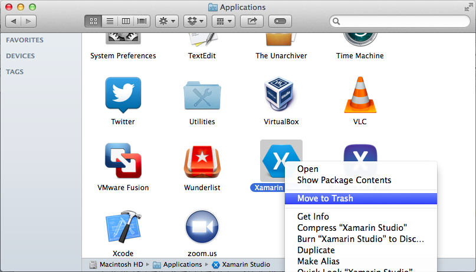
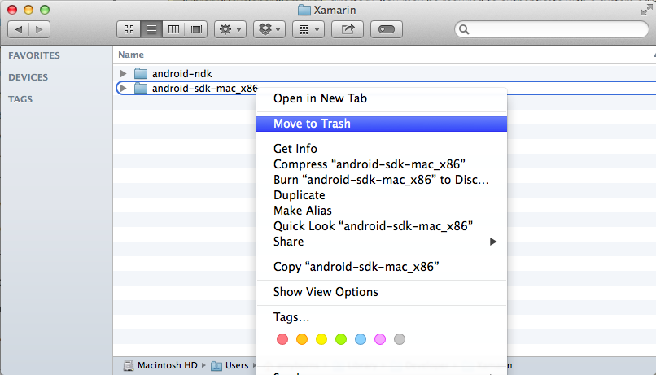
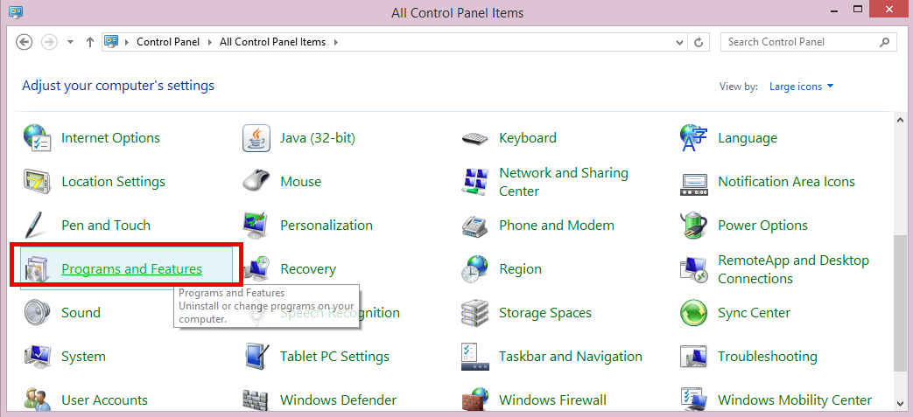
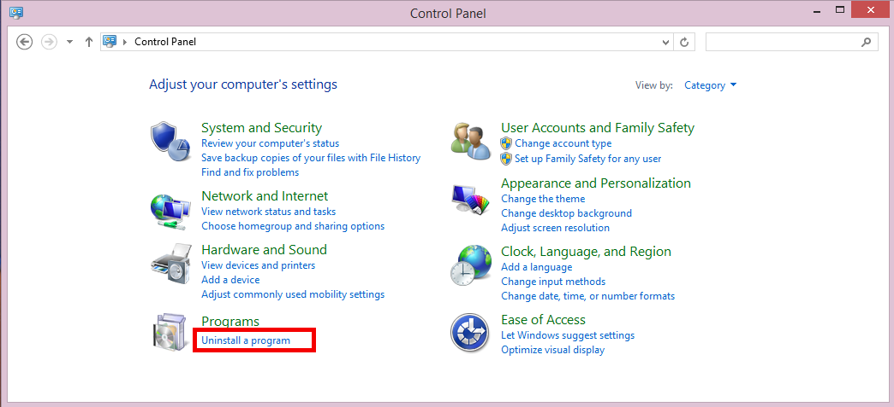
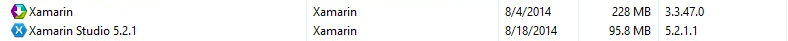

#卸载Xamarin

*从计算机卸载Xamarin产品*

本文讲解如何从一个Mac或Windows计算机上卸载Xamarin Studio或其他Xamarin产品。


##概述
这里有很多Xamarin产品允许你在Mac或Windows机器上开发跨平台应用程序―――Xamarin Studio、Xamarin.Android、Xamarin.iOS和在Mac上的Xamarin.Mac。可能在某些情况下必须卸载Xamarin工具集。本指南指导你如何实现。

在本指南中我们可以了解:

* 1.[卸载 Xamarin Studio](#Uninstall-Xamarin-Studio)
* 2.[卸载 Mono](#Uninstall-Mono-SDK)
* 3.[卸载 Xamarin.Android](#Uninstall-Xamarin-Android)
* 4.[卸载 Xamarin.iOS](#Uninstall-Xamarin-iOS)
* 5.[卸载 Xamarin.Mac](#Uninstall-Xamarin-Mac)
* 6.[从Windows卸载 Xamarin](#Uninstalling-Xamarin-on-Windows)

如果你想使用通用安装程序重装Xamarin，在安装之前，建议您先重启计算机。

##在Mac上卸载Xamarin
通过导航到相应章节了解卸载每个单独的产品, 或如果你希望完全从你的机卸载整个Xamarin，可按照下面的指引。

要了解有关使用[卸载脚本](http://developer.xamarin.com/guides/cross-platform/getting_started/installation/uninstalling_xamarin/Resources/xamarin_uninstall.sh)的帮助，可跳到文档最底部的[使用卸载脚本](#Using_the_Uninstall_Script)部分。

###<a name="Uninstall-Xamarin-Studio"></a>卸载Xamarin Studio
从你的Mac上卸载Xamarin Studio的第一步，找到`/Applications` 目录中的`Xamarin Studio.app`并将它拖到`废纸篓`。或者, 你可以右击和选择`移动到废纸篓`，如下图所示：



移除这个app会捆绑移除Xamarin Studio, 然而还有其它Xamarin相关的文件仍遗留在你的系统。

要完全删除Xamarin Studio的所有痕迹, 在终端运行以下命令:

```shell
sudo rm -rf "/Applications/Xamarin Studio.app”
rm -rf ~/Library/Logs/XamarinStudio-*
rm -rf ~/Library/XamarinStudio-*
```

###<a name="Uninstall-Mono-SDK"></a>卸载Mono SDK(MDK)
Mono是一个Microsoft .NET框架的开源实现，它使用在Xamarin所有产品上 ―― Xamarin.iOS,、Xamarin.Android和Xamarin.Mac，以允许在这些平台上用 C# 来开发.

> 注意: 有Xamarin以外的其他应用程序也使用Mono, 如Unity。在删除Mono前请确认没有其它程序依赖它。

要从你的机器移除Mono框架，在终端运行以下命令：

```shell
sudo rm -rf /Library/Frameworks/Mono.framework
sudo pkgutil --forget com.xamarin.mono-MDK.pkg
```

###<a name="Uninstall-Xamarin-Android"></a>卸载 Xamarin.Android
Xamarin.Android 允许你使用Xamarin Studio内置的`C#`或者`F#`开发Android。安装和使用Xamarin.Android有许多需求项, 如Android SDK和Java SDK。你能在[手动安装指南](#TODO)获得更多关于这些需求组件的信息。

使用以下命令移除 Xamarin.Android:

```shell
sudo rm -rf /Developer/MonoDroid
rm -rf ~/Library/MonoAndroid
sudo pkgutil --forget com.xamarin.android.pkg
```

####``卸载 Android SDK 和 Java SDK``
开发Android应用程序需要Android SDK。如果你再也不想开发Android，你可以卸载Android SDK: 找到`~/Library/Developer/Xamarin/` 并将其移除到垃圾箱, 如下图所示：



Java SDK (JDK) 不需要卸载, 它已经是Mac OS X中预置的包。

###<a name="Uninstall-Xamarin-iOS"></a>卸载 Xamarin.iOS
Xamarin.iOS允许你在Mac上的Xamarin Studio中使用`C#`或`F#`开发iOS应用程序。Xamarin Build Host也自动用Xamarin.iOS安装，以允许在Visual Studio中开发iOS。要从你的机器卸载二者，按以下步骤：

1.使用以下终端命令从你的文件系统移除所有Xamarin.iOS 文件： 

```shell
rm -rf ~/Library/MonoTouch
rm -rf /Library/Frameworks/Xamarin.iOS.framework   
sudo pkgutil --forget com.xamarin.xamarin-ios-build-host.pkg
``` 

2.卸载Mac Build Host ―― 运行以下终端命令以移除Build Host应用程序：

```shell
rm -rf "/Applications/Xamarin.iOS Build Host.app”
```

3.Build Host处理或启动任务可能还在运行或在侦听特定的端口。你可以通过在终端运行 `launchctl list | grep com.xamarin.mtvs.buildserver` 检查他的状态。

```shell
sudo launchctl unload /Library/LaunchAgents/com.xamarin.mtvs.buildserver.plist
sudo rm -f /Library/LaunchAgents/com.xamarin.mtvs.buildserver.plist
```

###<a name="Uninstall-Xamarin-Mac"></a>卸载 Xamarin.Mac

一旦Xamarin Studio被成功卸载，Xamarin.Mac可以使用以下二个命令从你的机器移除：

```shell
rm -rf /Library/Frameworks/Xamarin.Mac.framework
rm -rf $HOME/Library/Xamarin.Mac
```

###<a name="Using_the_Uninstall_Script"></a>使用卸载脚本
如果您决定跳过上述步骤,想要运行[卸载脚本](http://developer.xamarin.com/guides/cross-platform/getting_started/installation/uninstalling_xamarin/Resources/xamarin_uninstall.sh)，你要按以下步骤运行它：

1. 下载卸载脚本，并记下下载位置。默认情况下是在 `/Downloads` 目录。
2. 打开终端，切换到包含脚本的目录，输入：
```shell
cd /location/of/file
```
3. 输入`pwd`会打印工作目录(就是当前所在的那个)。你应该能够看到脚本`xamarin_uninstall.sh`
4. 运行脚本:
```shell
./xamarin_uninstall.sh 
```

就这么多了。Xamarin现在应该成功从您的计算机删除。


##<a name="Uninstalling-Xamarin-on-Windows"></a>从Windows卸载 Xamarin 
通过 *控制面板* 可以从您的Windows机器上卸载Xamarin。导航到 *程序和功能*，或 *程序 > 卸载一个程序*，如下图所示：





要卸载 Xamarin Studio，找到在程序列表中的 Xamarin Studio 5.x.x 和点击卸载按钮。要卸载Visual Studio的Xamarin扩展和SDKs, 找到程序列表中的 Xamarin和点击卸载。如下面的截图中所示:



要想干净的删除，这里还有一些你需要移除的程序，如下列表：

* Android SDK


* GTK#


* Xamarin Universal Installer


* Java SDK (删除这个时要小心, 可能有其它程序依赖它)


##小结
在本文我们看到通过使用终端命令完全从你的Mac卸载Xamarin，也可以通过 *程序和功能* 选项从你的Windows机器中卸载Xamarin。
