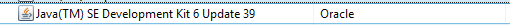

#卸载Xamarin

`从计算机卸载Xamarin产品`

这篇文章讲解如何从一个Mac或Windows计算机上卸载Xamarin Studio或其他Xamarin产品。


##概述
这里有很多Xamarin产品允许你在你的Mac或Windows机器上开发跨平台应用程序―――Xamarin Studio、Xamarin.Android、Xamarin.iOS和在Mac上的: Xamarin.Mac。可能在某些情况下必须卸载Xamarin工具集。本指南就是为帮你实现这个而建。

在本指南中我们可以看看:

* 1.[卸载 Xamarin Studio](#Uninstall-Xamarin-Studio)
* 2.[卸载 Mono](#Uninstall-Mono-SDK)
* 3.[卸载 Xamarin.Android](#Uninstall-Xamarin-Android)
* 4.[卸载 Xamarin.iOS](#Uninstall-Xamarin-iOS)
* 5.[卸载 Xamarin.Mac](#Uninstall-Xamarin-Mac)
* 6.[从Windows卸载 Xamarin](#Uninstalling-Xamarin-on-Windows)

如果你想使用通用安装程序重装Xamarin，在安装之前，建议您重新启动计算机。

##在Mac上卸载Xamarin
可通过导航到相应的章节了解卸载每个单独的产品, 或如果你希望完全从你的机卸载整个Xamarin，可一路跟随下面的指引。
要了解有关使用卸载脚本的帮助，可跳到文档最底部的卸载脚本部分。

###<a name="Uninstall-Xamarin-Studio"></a>卸载Xamarin Studio
从你所Mac上卸载Xamarin Studio的第一步，是定位到在 /Applications 目录中的Xamarin Studio.app和 将它拖到废纸篓。或者, 你可以右击和选择“移动到废纸篓”，如下图所示：


删除这个app装捆绑移除Xamarin Studio, 然而, 还有其它Xamarin相关的文件仍遗留在你的系统。

要删除Xamarin Studio的所有痕迹, 在终端运行以下命令:

```shell
sudo rm -rf "/Applications/Xamarin Studio.app”
rm -rf ~/Library/Logs/XamarinStudio-*
rm -rf ~/Library/XamarinStudio-*
```

###<a name="Uninstall-Mono-SDK"></a>卸载 Mono SDK (MDK)
Mono 是一个Microsoft的 .NET 框架的开源实现，和使用在Xamarin 所有产品――Xamarin.iOS,、Xamarin.Android和Xamarin.Mac，以允许在这些平台上用C# 来开发.

> 注意: 有Xamarin以外的其他应用程序也使用Mono, 如Unity。在删除Mono前请确认没有其它程序依赖它。

要从你的机器移除Mono框架，在终端运行以下命令：

```shell
sudo rm -rf /Library/Frameworks/Mono.framework
sudo pkgutil --forget com.xamarin.mono-MDK.pkg
```

###<a name="Uninstall-Xamarin-Android"></a>卸载 Xamarin.Android
Xamarin.Android 允许你使用Xamarin Studio内置的C#或者F#开发Android。安装和使用Xamarin.Android有许多需求项, 如Android SDK和Java SDK。你能在[手动安装指南](#TODO)获得更多关于这些需求组件的信息。

使用以下命令移除 Xamarin.Android:

```shell
sudo rm -rf /Developer/MonoDroid
rm -rf ~/Library/MonoAndroid
sudo pkgutil --forget com.xamarin.android.pkg
```

``卸载 Android SDK and Java SDK``
开发Android应用程序需要Android SDK。如果你再也不想开发Android，你可以卸载Android SDK: 定位到在 ~/Library/Developer/Xamarin/ 的文件和移除到垃圾箱, 如下图所示：


Java SDK (JDK) 不需要卸载, 它已经是Mac OS X中预置的包。

###<a name="Uninstall-Xamarin-iOS"></a>卸载 Xamarin.iOS
Xamarin.iOS允许你在Mac上的Xamarin Studio中使用C#或F#开发iOS应用程序。Xamarin Build Host也用 Xamarin.iOS自动安装，以允许在Visual Studio中开发iOS。要从你的机器卸载二者，按以下步骤：

1.使用以下终端命令从你的文件系统移除所有Xamarin.iOS 文件： 

```shell
rm -rf ~/Library/MonoTouch
rm -rf /Library/Frameworks/Xamarin.iOS.framework   
sudo pkgutil --forget com.xamarin.xamarin-ios-build-host.pkg
``` 

2.卸载 Mac Build Host――运行以下终端命令以移除 Build Host 应用程序：

```shell
rm -rf "/Applications/Xamarin.iOS Build Host.app”
```

3.Build Host 处理或启动任务可能还在运行或在侦听特定的端口。你可以通过在终端运行 launchctl list | grep com.xamarin.mtvs.buildserver 检查他的状态。

```shell
sudo launchctl unload /Library/LaunchAgents/com.xamarin.mtvs.buildserver.plist
sudo rm -f /Library/LaunchAgents/com.xamarin.mtvs.buildserver.plist
```

###<a name="Uninstall-Xamarin-Mac"></a>卸载 Xamarin.Mac

一旦 Xamarin Studio 已被成功卸载，Xamarin.Mac可以使用以下二个命令从你的机器移除：

```shell
rm -rf /Library/Frameworks/Xamarin.Mac.framework
rm -rf $HOME/Library/Xamarin.Mac
```

###使用卸载脚本
如果您决定跳过上述步骤,想要运行卸载脚本，你要按以下步骤运行它：
1.下载卸载脚本，并记下下载位置。默认情况下是在 /Downloads 目录。
2.打开终端和切换到包含脚本的目录，输入：
```
cd /location/of/file
```
3.输入 pwd 会打印工作目录 (就是当前所在的那个). 你应该能够看到脚本 xamarin_uninstall.sh
4.运行脚本:
./xamarin_uninstall.sh 

就这样。Xamarin现在应该成功从您的计算机删除。


##<a name="Uninstalling-Xamarin-on-Windows"></a>从Windows卸载 Xamarin 
通过控制面板可以从您的Windows机器上卸载Xamarin。导航到程序和功能，或程序 > 卸载一个程序，如下图所示：


要卸载 Xamarin Studio，找到在程序列表中的 Xamarin Studio 5.x.x 和点击卸载按钮。要卸载Visual Studio的Xamarin扩展，和 SDKs, 找到程序列表中的 Xamarin和点击卸载。如下面的截图中所示:


要想干净的删除，还有一些你想移除的程序，如下面的列表：

* Android SDK


* GTK#


* Xamarin Universal Installer


* Java SDK (删除这个时要小心, 可能存在其它程序依赖它)




##小结
在本文我们看到通过使用终端命令完全从你的Mac卸载Xamarin，也通过程序和功能选项从你的Windows机器中卸载Xamarin。
