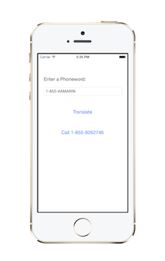
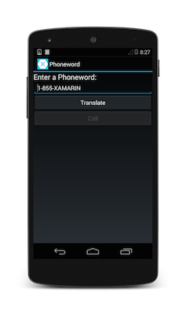

#移动开发简介

构建移动应用程序可以像打开你的IDE一样简单, 塞点东西, 做一点快速测试, 并提交到一个App商店 —— 所有工作在一个下午完成。或者它可以是一个非常复杂的过程，包括严格的预先设计, 可用性测试, 成千上万的设备上的QA测试, 一个完整的beta生命周期, 然后是许多的部署方式。

在本文档, 我们将要全面介绍如何构建一个Xamarin移动应用程序, 包括：
1.[必要条件](#Requirements) – 我们会枚举和审查构建iOS和Android应用程序的需求。 
2.[Xamarin简介](#Xamarin) – Xamarin平台特性列表。 
3.[Xamarin如何工作?](#How-Does-Xamarin-Work) – Xamarin如何将C#带到iOS和Android开发的原理的简要概述。 
4.[入门!](#Getting-Started) – 在iOS, Android, 或使用Xamarin.Forms在所有平台上，构建您的第一个Xamarin应用程序。 

本文旨在介绍Xamarin平台。要了解更多关于构建移动应用程序从设计到测试的过程, 参阅[移动应用开发生命周期简介](05_Introduction_to_the_Mobile_SDLC.md) 文档。

##必要条件
如果你想开发iOS, 无论你想在Xamarin Studio还是在Visual Studio中编写代码, 你手头上必须有一台装有最新OS X Mountain Lion系统的苹果MAC电脑。虽然Xamarin应用程序基于.NET BCL和用C#编写,Xamarin仍需要iOS SDK和Xcode以便编译。此外, iOS设备模拟仿真器是iOS SDK的一部分, 因此只能在Mac上。为了下载iOS SDK, 你必须是[Apple开发者计划](http://developer.apple.com/)。这个计划需要升级会员，每年$99美金。

这里介绍的所有教程是基于最新版本。安装在下一教程中介绍。

##Xamarin简介
在考虑如何构建iOS和Android应用程序时，许多人认为原生的语言Objective-C和Java, 分别是仅有的选择。然而在过去的几年中, 出现了新的完整平台的生态系统来构建移动应用程序。

Xamarin独特的地方是通过提供一个单一的语言 – C#, 类库, 并运行在跨所有三种移动平台:iOS, Android,和Windows Phone(Windows Phone的原生语言就是C#)上, 同时还编译成原生(非解释型的)应用程序，性能甚至可以满足苛刻的游戏。

每个平台都有不同的功能集，并且每种不同的地方都可以按原生的来编写应用程序 – 也就是说, 编译为本机代码的应用程序与底层Java子系统流利互操作。例如, 某些平台上只允许您用HTML和JavaScript开发应用程序,而一些又非常低级，只允许C/C++代码，甚至某些平台上不利用本机控件工具包。

Xamarin是独特的，它结合了所有的原生平台的力量，并增加了一些强大的自己的特点, 包括：

1. **编译绑定原生SDKs** – Xamarin包含几乎整个基础平台SDKs的绑定，包括iOS和Android。此外, 这些绑定是强类型的，这意味着它们很容易浏览和使用,并提供在编译和开发期间强大的类型检查。这导致运行时错误更少和更高质量的应用。
2. **Objective-C、Java、C和C++互操作** – Xamarin提供用于直接调用Objective-C、Java、C、和C++的库, 给你使用大量已经创建的第三方代码库的能力。这允许您利用现有的用Objective-C、Java或C/C++编写的iOS和Android库。此外,Xamarin提供绑定项目，允许你轻松绑定原生Objective-C和Java库使用声明性语法。 
3. **现代语言构造** – Xamarin应用程序用C#编写, 这是一个现代语言，包括对Objective-C和Java的重大改进，如动态语言特性, 函数式构造如lambda, LINQ,并行编程特性, 复杂的泛型等等。 
4. **惊人的基类库(BCL)** – Xamarin 应用程序使用.NET BCL, 一个巨大的类集合，它具有综合和优化功能，如强大的XML, 数据库, 序列化, IO, 字符串和网络支持等,仅以这些为例。此外, 现有的C#代码能编译到你的应用程序中使用, 它提供了访问成千上万的库，BCL上已经有很多你想做的东西。
5. **现代集成开发环境(IDE)** – Xamarin在Mac OS X上使用Xamarin Studio, 在Windows上使用Xamarin Studio或Visual Studio 2013。这些都是现代IDE，包括的特性如代码自动完成、复杂的项目和解决方案管理系统、一个全面的项目模板库、集成源代码管等等。 
6. **手机跨平台支持** – Xamarin为iOS、Android和Windows手机这三大移动平台提供复杂的跨平台支持。应用程序可以共享编写其多达90%的代码, 并且我们的Xamarin.Mobile库在所有三个平台提供一个统一的API来访问公共资源。这对于以市场为目标的三个最流行移动平台的开发人员，可以显著降低开发成本和时间。

由于Xamarin的强大和全面的功能集, 应用程序开发人员希望使用一个现代语言和平台开发跨平台手机应用程序，它填补了一项空白。

注意:

此入门系列的重点是开始建立iOS和Android应用程序。如果你对构建Windows Phone感兴趣, Microsoft提供的教程在[这里](http://dev.windowsphone.com/en-us/develop)。如果你想要了解更多关于Xamarin跨平台开发(包括 Windows Phone), 你可以在[这里](http://developer.xamarin.com/guides/ios/application_fundamentals/building_cross_platform_applications)找到指南。

让我们来看看这里的工作原理。

##Xamarin如何工作?
Xamarin提供了两个商业产品: Xamarin.iOS和Xamarin.Android。他们都建立在Mono之上, 这是一个基于.NET框架的开源版本，按已发布的.NET ECMA规格。Mono的历史差不多和.NET框架本身一样久,可在几乎任何平台上运行，包括Linux, Unix, FreeBSD和Mac OS X.

在iOS上,Xamarin的`Ahead-of-Time(AOT)`编译器直接编译Xamarin.iOS应用程序到原生ARM汇编代码。在Android上,Xamarin的编译器编译到中间语言(IL),然后当应用程序启动时，`Just-in-Time(JIT)`编译为本机程序集。

在这些情况下,Xamarin应用程序利用运行时自动处理一些事情，如内存分配, 垃圾收集,底层平台互操作,等等。

###MonoTouch.dll 和 Mono.Android.dll
Xamarin applications是对称为Xamarin Mobile Profile的.NET BCL的子集的的构建。这个profile专门为移动应用程序创建，并打包入MonoTouch.dll和Mono.Android.dll(分别为iOS和Android)。这很像Silverlight (和Moonlight)应用程序是对Silverlight/Moonlight .NET Profile的构建。实际上,Xamarin Mobile profile相当于Silverlight 4.0 profile重新添加一堆BCL类。

有关可用程序集和类的完整列表, 查阅 [Xamarin.iOS 组合表](http://developer.xamarin.com/guides/ios/advanced_topics/assemblies) 和 [Xamarin.Android 组合表](http://developer.xamarin.com/guides/android/advanced_topics/assemblies)。

除了BCL, 这些`.dlls`包括几乎所有iOS SDK和Android SDK，允许你直接从C#调用底层SDK APIs。

###应用程序输出
当 Xamarin 应用程序被编译, 结果是一个应用程序包, 要么是在iOS中的一个`.app`文件, 要么是在Android中的一个 `.apk`文件。这些文件和原生应用程序包没有什么区别，并且以同样方式部署。

##入门
现在您已经了解Xamarin是如何工作了, 是时候开搞了!

下一步是使用这些指南之一，开始创建第一个应用:

* [Hello, iOS](http://developer.xamarin.com/guides/ios/getting_started/hello%2c_world)

* [Hello, Android](http://developer.xamarin.com/guides/android/getting_started/hello%2c_world)

* [Xamarin.Forms简介](http://developer.xamarin.com/guides/cross-platform/xamarin-forms/introduction-to-xamarin-forms/)

##小结
本文只是介绍了Xamarin平台。当你的应用程序运行时，真正的乐趣才开始。查阅[Hello, iOS](http://developer.xamarin.com/guides/ios/getting_started/hello%2c_world),[Hello, Android](http://developer.xamarin.com/guides/android/getting_started/hello%2c_world), 和[Xamarin.Forms简介](http://developer.xamarin.com/guides/cross-platform/xamarin-forms/introduction-to-xamarin-forms/)指南以开始。