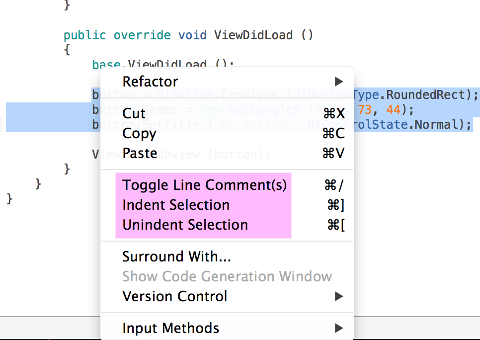

#Xamarin Studio简介
**Xamarin集成开发环境**

本文提供Xamarin Studio的概述,这是一个用于创建iOS, Mac和Android应用程序的集成开发环境(IDE),展示了让它成为一个在Xamarin平台上创建原生移动和桌面应用程序的优秀工具的功能。

##概述
Xamarin Studio是一个现代, 复杂的IDE，有许多特性用于创建iOS, Mac和Android应用程序。它包括一个丰富的编辑器, 调试器, 与iOS, Mac和Android等原生平台集成, 集成源码控制等，仅举部分特性为例。

本文分析Xamarin Studio的各个部分, 看看使它成为一个创建应用程序的强大工具的一些特性。

##IDE 一览
Xamarin Studio被组织成几个部分,以管理应用程序文件和设置，创建应用程序代码和调试。

下图显示Xamarin Studio加载了一个程序程序:

以下章节提供在Xamarin Studio中的主要区域的概览。

###欢迎屏幕
刚启动时, Xamarin Studio显示一个如下图所示的欢迎屏幕:

欢迎屏幕包含以下部分:

* **工具栏** – 提供快捷方式到Xamarin的 *Developer Center*, *Support* 和 *Forums*, 还有快速访问你的Xamarin账户。
* **解决方案** – 提供快速访问最近打开的解决方案, 以及打开或创建项目的按钮。
* **Xamarin新闻** – 了解最新Xamarin信息的新闻种子。
* **预建的Apps** – 完整的应用程序，以帮助开始一个应用程序开发。
* **开始试用** – 提供快速访问开始一个免费30天商业版试用。

###解决方案面板
解决方案面板在解决方案中组织项目,如下所示:

这里是一些源代码, 资源, 用户界面,和管理的程序集引用。当一个解决方案面板中的某个项目被选中, 在此项目的右边有一个按钮，可用来访问这个项目的上下文菜单, 也可以通过右击该项目显示这个菜单。

下图显示了一个 C# 源码文件的上下文菜单:

###程序集引用
程序集引用放在引用文件夹下, 如下所示:

添加引用是通过 `引用`文件夹的`Edit References`上下文菜单项目, 或通过右击文件夹, 打开`Edit References` 对话框:

选定的程序集的列表显示在对话框右侧。在Edit References对话框中点击OK按钮时，选定的程序集将添加到项目中。

###组件
Xamarin 组件是强大的特性，它允许用户界面组件作为库和主题，以轻松添加到项目中。可以通过右击组件文件夹，然后点击 *Get More Components...* 来访问组件商店:

通过项目引用之前，可以指定Xamarin组件要提取的目录。这会允许多个解决方案使用相同目录下的组件，并防止当一个项目是在不同项目的上下文菜单中打开时，开始时的程序集引用被修改。

要了解更多在Xamarin Studio中使用组件的信息，参阅[导入一个组件到你的项目](#TODO) 攻略。

###NuGet
NuGet已集成到Xamarin Studio。这让开发者能够搜索数目庞大的NuGet包, 并添加他们到Xamarin.iOS或Xamarin.Android项目。

更多在应用程序中使用NuGet包的信息，参阅[导入一个NuGet到你的项目](#TODO)。

###项目设置
双击项目条目或从它的上下文菜单中选择`Options`，打开项目Options对话框，如下所示:

这个对话框允许你应用各种项目级别设置, 分为以下几部分:

* *General* – 常规设置, 如应用程序名称, 版本, 说明和默认命名空间。
* *Build* – 编译器选项, 构建配置, 程序集名和输出路径; 以及特定于平台的构建, 打包和应用程序设置。
* *Run* – 执行脚本和命令。
* *Source Code* – 代码格式, 约定和命名策略。
* *Version Control* – 提交消息样式和更改日志集成。

###编辑器
Xamarin Studio的特点是现代的、复杂的源码编辑器。编辑器区域用标签界面，如下所示:

编辑器包括几个特点，如下所示。

####语法高亮
在编辑器中的代码根据各种语言关键字和结构突出显示, 如下图所示：关键字, 类型和字符串常量用不同的颜色：

####代码自动完成
当你输入时会在一个弹出窗口提示自动完成代码，使得可以更容易的探索APIs。下图显示了弹出的自动完成列表:

####代码导航
Xamarin Studio支持包括寻找任何变量或类型的声明, 以及他们使用的任何引用。可以从编辑器的上下文菜单使用这个功能:

选择`Go to declaration`让编辑器导航到变量声明或到程序集的类型浏览。`Find references`展示了在项目中使用到这个变量或类型的位置的列表, 如下所示:

####面包屑导航菜单
位于标签下面的正是面包屑导航菜单, 可以在选择的文件中探索包含的类结构。

####气泡提示
当鼠标悬停在一些代码元素上面时，会出现一个丰富详细的气泡提示。这些显示信息一般是比如函数签名, 摘要说明和代码模板预览, 如下所示:

####重构
Xamarin Studio提供以下重构功能:

* 重命名
* 创建属性
* 创建 getter
* 抽取方法
* 通过foreach遍历
* 声明局部变量

这里有一些基于所选代码的可用的编辑器上下文菜单。下图显示当光标停留在一个变量上时，重构的上下文菜单:

####缩进和注释
编辑器包括代码自动缩进支持, 通过选择主菜单的`Edit > Format > Format Document` 可以应用到整个文件。 

此外, 缩进以及注释可以在编辑器的上下文菜单切换：

####代码片段
Xamarin Studio包括代码模板支持, 可以轻松添加常见的代码结构。工具箱中有可用的代码片段的完整清单:

当在编辑器中键入代码时,代码自动完成列表中会出现代码片段, 可以选择他们，将辅助代码插入到编辑器, 下图所示就是插入一个enum代码片段:

####代码建议
Xamarin Studio 能够提出代码简化或优化代码的建议。当IDE找到如更改, 在可能被改变的代码上面会出现一个蓝色的背景框。将鼠标移到这行会弹出这个变更的解释:

选择选项将相应地更改代码。如果不需要做更改, 在编辑器窗口的其它任意位置单击或按键盘上的Escape键。

###编辑器并排支持
Xamarin Studio允许并排打开文本编辑窗口, 或让一个窗口作为浮动窗口。

2列模式可以通过选择`View > Editor Layout > 2 columns` 菜单启用，或通过将编辑选项卡拖动到编辑器区域的边缘, 如下所示:

编辑器标签可以拖动到文档区域之外，变成一个浮动编辑窗口。这个浮动窗口也支持并排编辑, 并可以包含几个编辑标签：

要回到单个打开的编辑器, 选择 `View > Editor Layout > 1 column`。

###统一搜索
Xamarin Studio 包括统一搜索, 位于IDE的右上角, 搜索解决方案的类型和文件，以及可用的命令。

匹配的结果分为以下几个部分:

* *Top Result* – 显示最匹配搜索字符串的结果。
* *解决方案* – 显示一个在解决方案内匹配类型的列表。
* *文件* – 显示匹配搜索字符串的文件列表。
* *Commands* – 显示一个搜索字符串的可用命令的列表。

下图显示了在解决方案中搜索“app"的结果列表:

Selecting an item in the result list navigates to that item in the editor.

###程序集浏览器
Xamarin Studio 也包括一个程序集浏览器，用来导航到任何程序集的类型引用。可以从解决方案面板双击加载程序集到浏览器中。

For example, the following screenshot shows the System assembly loaded in the Assembly Browser:

####Assembly Search
The Assembly Browser also supports search with auto-complete. For example, typing CAD in the search box displays the following types:

The Assembly Browser is also integrated with the code editor, where selecting Go to declaration on a type that exists in a referenced assembly will navigate to that type in the Assembly Browser. For example, the following shows the Assembly Browser with the UIWindow loaded after it was selected in the code editor:

###Debugging
Xamarin Studio includes integrated debugging for both iOS and Android projects on simulators and emulators, as well as on devices. The debugger includes the following windows:

Watch – Allows variables to be added for inspecting values.
Locals – Inspects values of locally declared variables.
Breakpoints – Manage breakpoints in the project.
Threads – View running threads.
Call Stack – Lists and navigates the call stack.
Immediate – Evaluation of expressions.
The following image shows the debugger stopped at a breakpoint with the inline watch popup displayed when hovering over a variable:

Xamarin Studio's debugger contains rich visualizers for special types such as strings, colors, URLs as well as the sizes, co-ordinates and bézier curves.

Clicking on the preview icon next to a name, shows the value of that property. In the image below, the inspector shows the value, and a preview of the title color of our button:

For more information on the debugger visit to Debugger guides.

Source Control Integration
Xamarin Studio integrates with Git and Subversion source control systems. Projects under source control are denoted with an annotation on their icons in the Solution Pad, as shown below:

For a project under source control, the context menu of the item in the Solution Pad will have its Version Control menu enabled, showing various commands, as shown below:

Also, the main menu’s Version Control menu includes a variety of additional commands for working with source control:

Differences, History and Merging
To inspect differences in the selected file, change history and perform merges, several buttons at the bottom of the editor area are available. For example, the following screenshot shows the differences between a local source file and the latest committed version:

Native Platform Integration
Xamarin Studio features integration with native platform tools for both iOS and Android. This allows using various code-signing, deployment, and diagnostics tools.

Tools Menu
The following screenshot shows the iOS Tools menu in Xamarin Studio:

Under the Tools menu, there are several items that launch native platform tools, including:

Instruments – iOS profiling and diagnostics tool.
Application Loader – iOS utility that assists in preparing apps for sale in the iTunes App Store.
Google Emulator Manager – Android utility to manage emulators.
Android SDK Manager – Android utility to install Android SDKs

Info.plist [iOS and Mac only]
In addition to source code editing, the tabbed interface includes support for certain platform specific files. For example, when opening an Info.plist file, which is used by iOS applications to store various configuration data, the following user interface is presented to allow easy editing of the file:

iOS Designer
The iOS Designer is fully integrated with Xamarin studio and enables visual editing of Storyboard files. The entire user interface can be built using drag-and-drop functionality between the Toolbox and Design Surface, while using a much more intuative approach to handling events. The iOS Designer also supports custom controls with the added benefit of design-time rendering.

For more information on using the iOS Designer, refer to the Designer documents.

Android Designer
For Android applications, Xamarin Studio includes its own designer, which works with Android .axml files to visually construct user interfaces. Xamarin Studio will open these files in its Android designer, as shown below:

For more information on the Android designer see the Designer Overview document.

Release Notes
The latest release notes for all installed Xamarin products can all be accessed via the Help menu bar item in Xamarin Studio. This will open a link in your browser:

Summary
This document presented various parts of Xamarin Studio. It showed the areas of the IDE used for file management, such as the Solution Pad and Version Control integration. It also exhibited the rich source code editor, search, code completion, and code navigation features that make working with a complex code base a breeze. Finally, it introduced features for integrating with native platform tools on both iOS and Android.