#用插件扩展Xamarin Studio

**Xamarin Studio的特性和功能可以用叫做插件的模块来扩展。指南的第一部分创建一个简单的Xamarin Studio 插件来插入数据和时间到文档。第二部分介绍插件系统的基础和Xamarin Studio基础的一些核心API**

##概述
Xamarin Studio 由一些叫`插件`的模块集组成。我们可以用插件来引入新功能到Xamarin Studio, 如支持额外语言或新项目模板。

Add-ins build off of the `extension` points of other add-ins. Extension points are placeholders for areas that can be expanded upon, such as a menu or the list of IDE Commands. An add-in can build off an extension point by registering a node of structured data called an extension, such as a new menu item or a new Command. Each extension point accepts certain types of extensions, such as a `Command`, `Pad`, or `FileTemplate`. A module that contains extension points is called an `add-in` host, as it can be extended by other add-ins.

To customize Xamarin Studio, we can create an add-in that builds off extension points contained in add-in hosts within pre-existing libraries in Xamarin Studio, as illustrated by the diagram below:

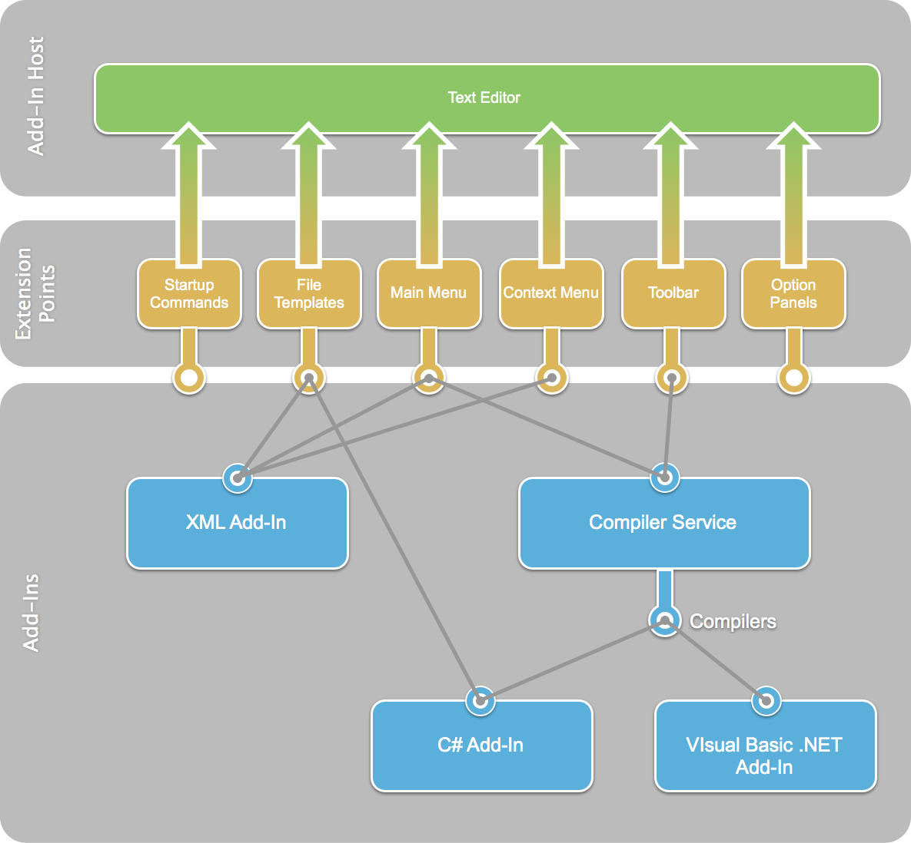

In order for an add-in to build off of Xamarin Studio, it must have extensions that build off of pre-existing extension points within the Xamarin Studio IDE. When an add-in relies on an extension point defined in an add-in host, it is said to have a `dependency` on that add-in.

The benefit of this modular design is that Xamarin Studio is extremely extensible -- there are many extension points that can be built upon with custom add-ins. Examples of current add-ins include support for C# and F#, debugger tools, and Project templates.

In the next section, we will cover the basics of creating an add-in as we learn to declare and build a type of extension called a `Command`.

> Note: If you have an Addin Maker project that was created before Addin Maker 1.2, you will need to migrate your project as outlined in the steps [here](https://mhut.ch/addinmaker/1.2).

##Part I: Add-in Walkthrough
In this section, we’re going to build [a simple add-in](https://github.com/mjh4/AddIns/tree/master/DateInserter) to illustrate the concepts we learned in the previous section. Our add-in will create a new Command in Xamarin Studio’s `Edit menu` that allows the user to insert the current date and time into an open text document, as illustrated by the screenshot below:

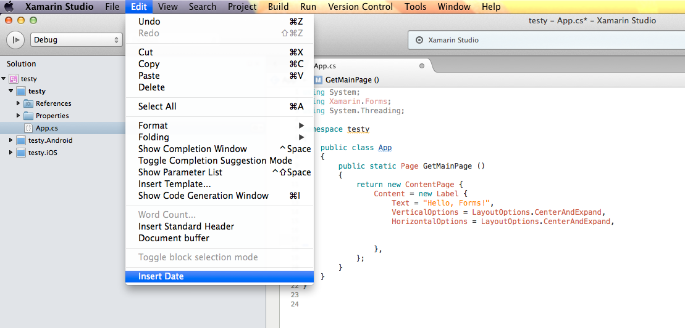

In our example, we will use the Add-in Maker to jump-start our development. The Add-In Maker – which is also an add-in - creates a new Project template and populates it with the required files for our custom add-in.

* Let’s begin by launching Xamarin Studio if it’s not already open:

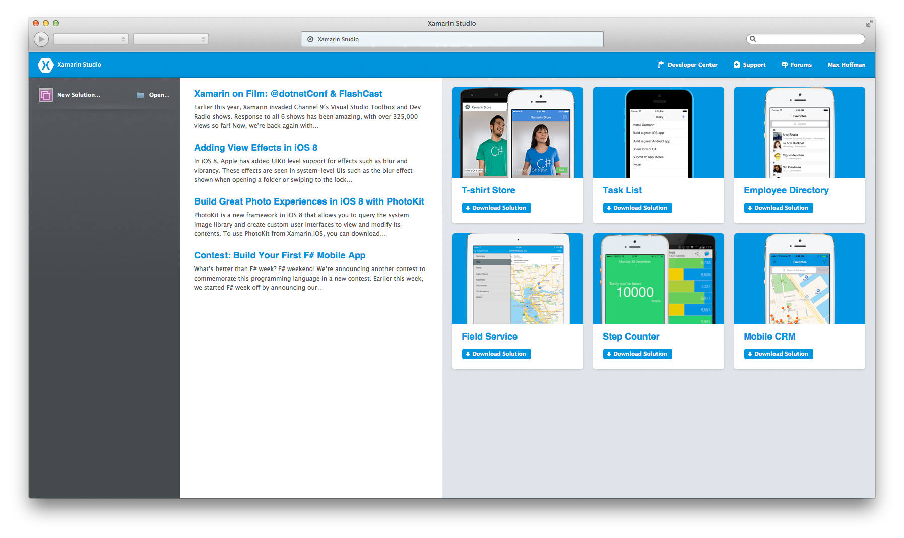

* Next, let’s install the `Add-in Maker add-in` using the `Add-in` Manager. From the Xamarin Studio `menu`, choose `Add-in` Manger:

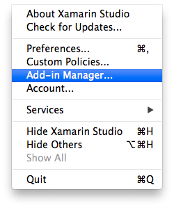

* Navigate to the Gallery tab and type `Addin Maker` into the top-right search bar. Select Addin Maker from the Add-in Development category and click `Install`. If nothing shows up, hit Refresh and search again:

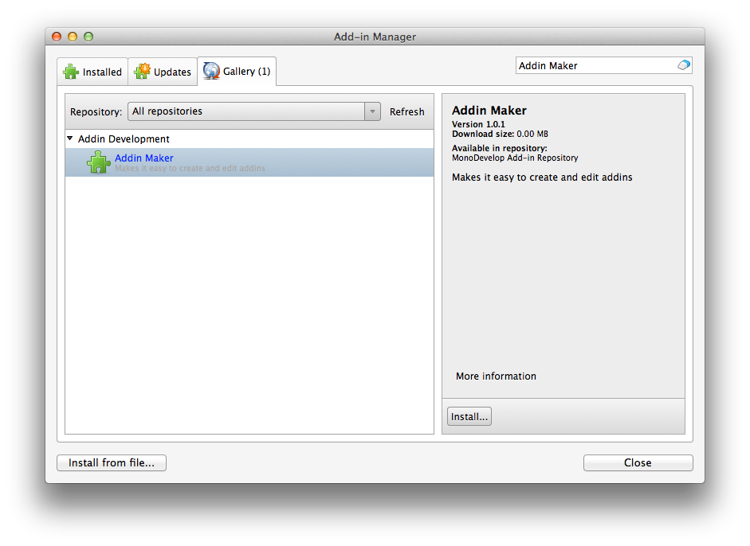

* Now that we have the Addin Maker installed, we can start building our add-in. In the top left, select New Solution:

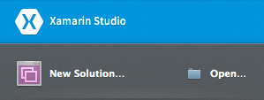

* From the `New Solution dialog`, choose `Other > Miscellaneous > General > Xamarin Studio Addin > C#` template and on the following screen name the new Solution `DateInserter`:

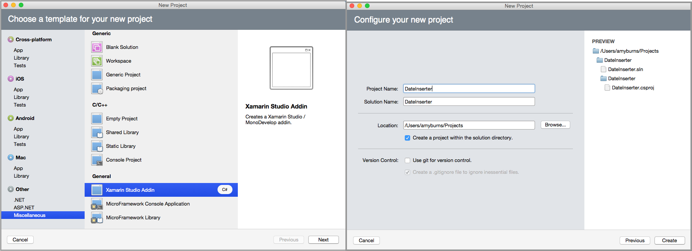

* Xamarin Studio will populate a Solution for us:

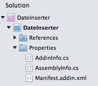

* Let’s remove the template code in `Manifest.addin.xml` and replace it with the following:

```xml
<?xml version="1.0" encoding="UTF-8"?>
<ExtensionModel>
    <Extension path = "/MonoDevelop/Ide/Commands/Edit">
        <Command id = "DateInserter.DateInserterCommands.InsertDate"
             _label = "Insert Date"
             defaultHandler = "DateInserter.InsertDateHandler" />
    </Extension>

    <Extension path = "/MonoDevelop/Ide/MainMenu/Edit">
        <CommandItem id="DateInserter.DateInserterCommands.InsertDate" />
    </Extension>

</ExtensionModel>
```

* Now let’s set up the files that will eventually handle inserting the date and time into the text editor. Right-Click on the project and add a new file. Select `General > Empty Class` and name the new file `InsertDateHandler`:

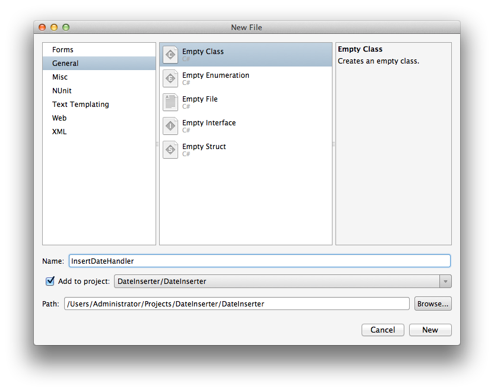

* Let’s remove the template code from 1InsertDateHandler.cs1 and replace it with the following code:

```c#
using MonoDevelop.Components.Commands;
 using MonoDevelop.Ide;
 using MonoDevelop.Ide.Gui;   
 using Mono.TextEditor;
 using System;  

 namespace DateInserter
 {
     class InsertDateHandler : CommandHandler
     {
         protected override void Run ()
         {

         }

         protected override void Update (CommandInfo info)
         {

         }   
     }
 }
```

We’ll expand these two placeholder methods later.

* Next, right-click on the `DateInserter` Project, then select `Add > New File`. Select `General > Empty Enumeration` and name the new file `DateInserterCommands`:

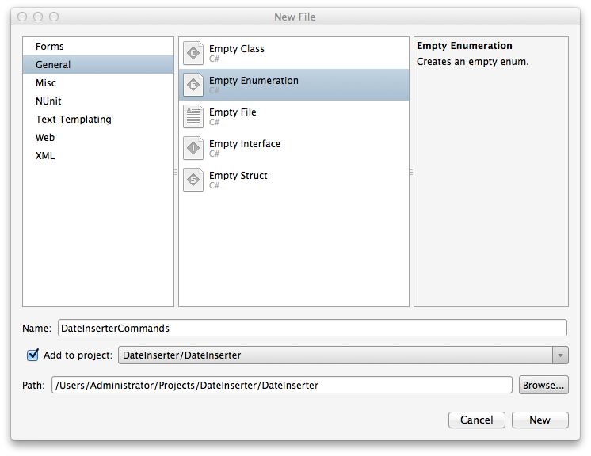

* Let’s add the `InsertDate` Command as a member of our new enumeration to our `DateInserterCommands.cs` file:

```c#
using System;

namespace DateInserter
{
    public enum DateInserterCommands
   {
       InsertDate,
   }
}
```

* At this point we should have a working add-in. We can test this out by saving our work and running the application. The IDE will launch a new instance of Xamarin Studio with our add-in installed. If we navigate to the `Edit menu`, we’ll see that Xamarin Studio has a new option called `Insert Date`, as illustrated by the screenshot below:

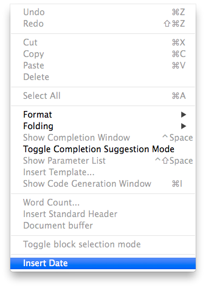

Note that selecting Insert Date from the menu will have no effect as our current implementation only has placeholder methods.

* The framework is in place for the add-in—now it’s time to write the code that powers inserting the datemake sure that the `Insert Date Command` is only enabled when the user has a text file open. Replace the `Update` method in `InsertDateHandler.cs` with the following code:

```c#
protected override void Update (CommandInfo info)
{
    Document doc = IdeApp.Workbench.ActiveDocument;  
    info.Enabled = doc != null && doc.GetContent<ITextEditorDataProvider> () != null;  
}
```

* Let’s update the Command’s `Run` method to insert the date and time with the following code:

```c#
protected override void Run ()
 {
     Document doc = IdeApp.Workbench.ActiveDocument;
     var textEditorData = doc.GetContent<ITextEditorDataProvider> ().GetTextEditorData ();  
     string date = DateTime.Now.ToString ();  
     textEditorData.InsertAtCaret (date); 
 }
```

* Finally, let’s run our add-in to test it. In the new instance of Xamarin Studio, select `Edit > Insert Date`. The current date and time is inserted at our caret, as illustrated by the screenshot below:

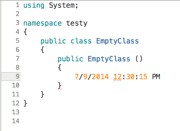

Congratulations on completing your first add-in for Xamarin Studio! Now it’s time to look under the hood and see how our add-in works.

##Part II: Add-in Deep Dive
In the walthrough above, we built an add-in that used a `Command` to insert the date and time into an open text document. In the second part of this guide we will the different files generated by the Add-in Maker and data a ommand extension requires.

###Attribute Files
Add-ins store metadata about their name, version, dependencies and other information in C# attributes. The Add-in Maker creates two files, `AddinInfo.cs` and `AssemblyInfo.cs` to store and organize this information. Add-ins must have a unique namespace and id specified in their Addin attribute:

```c#
[assembly:Addin (
        "DateInserter", 
        Namespace = "DateInserter",
        Version = "1.0"
    )]
```

Add-ins must also declare dependencies on the add-ins that own the extension points they plug into. In earlier versions of the Add-In Maker, we declared a dependency on the `MonoDevelop.Ide` and `MonoDevelop.Core` add-ins, which contain many of the IDE’s core extension points and APIs, as illustrated by the code below:

```c#
[assembly:AddinDependency ("::MonoDevelop.Core", MonoDevelop.BuildInfo.Version)]
    [assembly:AddinDependency ("::MonoDevelop.Ide", MonoDevelop.BuildInfo.Version)]
```

These Xamarin Studio Core and IDE assemblies are now automatically referenced at build time.

Furthermore, additional references can be added via the Add-in reference node in the solution pad for the project, as depicted below:

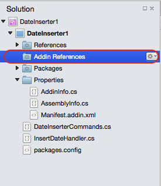

They will also have their corresponding `assembly:AddinDependency` attributes added at build time.

Once the metadata and dependency declarations are in place, we can focus on the essential building blocks of the add-in.

###Extensions and Extension Points
In the first part of this guide, we learned that an add-in is a way to package a collection of extensions and extension points. An extension point is a placeholder that defines a data structure (a type), while an extension defines data that conforms to a structure specified by a specific extension point. Extension points specify what type of extension they can accept in their declaration. Extensions are declared using type names or extension paths. See the [Extension Point reference](http://monoaddins.codeplex.com/wikipage?title=Extension%20Points&referringTitle=Description%20of%20Add-ins%20and%20Add-in%20Roots) for a more in-depth explanation on how to create the extension point you need.

The extension/extension point architecture keeps the development of Xamarin Studio fast and modular. Since there are a large amount of extension types, we will focus on the ones used in the add-in we just built.

####Command Extensions
In our walkthrough we used a Command Extension - an extension that points to methods that are called every time it is executed. Command Extensions are defined by adding entries to the `/MonoDevelop/Ide/Commands` extension point. We defined our extension in `Manifest.addin.xml` with the following code:

```xml
<Extension path = "/MonoDevelop/Ide/Commands/Edit">
            <Command id = "DateInserter.DateInserterCommands.InsertDate"
                 _label = "Insert Date"
                 _description = "Insert the current date" 
                 defaultHandler = "DateInserter.InsertDateHandler" />
        </Extension>
```

The extension node contains a path attribute that specifies the extension point it is plugging into, in this case `"/MonoDevelop/Ide/Commands/Edit"`. Additionally, it acts as a parent node to the Command. The Command node has the following attributes:

* **id** – Specifies the identifier for this Command. Command Identifiers must be declared as enumeration members, and are used to connect Commands to CommandItems.
* **_label**  – The text to be shown in menus.
* **_description**  – The text to be shown as a tooltip for toolbar buttons.
* **defaultHandler** – Specifies the `CommandHandler` class that will power the Command

To invoke the command from the Edit Menu, we created a CommandItem extension that plugs into the `/MonoDevelop/Ide/MainMenu/Edit` extension point:

```xml
<Extension path = "/MonoDevelop/Ide/MainMenu/Edit">
            <CommandItem id="DateInserter.DateInserterCommands.InsertDate" />
        </Extension>
```

A CommandItem places a Command specified in its id attribute into a menu. This CommandItem is extending the `"/MonoDevelop/Ide/MainMenu/Edit"` extension point, which makes our Command’s label appear in the Edit Menu. Note the id in our CommandItem above correlates to the id of the Command node, `InsertDate`. If we remove the CommandItem, the Insert Date option would disappear from the Edit Menu.

####Command Handlers
The `InsertDateHandler` is an extension of the `CommandHandler` class. It overrides two methods, `Update` and `Run`. The `Update` method is queried whenever a Command is shown in a menu or executed via key bindings. By changing the info object, we can disable the Command or make it invisible, populate array commands, and more. The Update method disables the command if it can’t find an ITextEditorDataProvider, as there isn’t an open document to insert text into:

```c#
protected override void Update (CommandInfo info)
            {
                Document doc = IdeApp.Workbench.ActiveDocument;  
                info.Enabled = doc != null && doc.GetContent<ITextEditorDataProvider> () != null;  

    }
```

We only need to override the `Update` method when we have special logic for enabling or hiding the Command. The `Run` method executes whenever a user executes a Command, which in this case occurs when a user selects the Command from the Edit Menu. This method inserts the date and time at the caret in the text editor:

```c#
protected override void Update (CommandInfo info)
            {
                Document doc = IdeApp.Workbench.ActiveDocument;  
                info.Enabled = doc != null && doc.GetContent<ITextEditorDataProvider> () != null;  
            }
```

In the final step, we declare our Command type as an enumeration member within `DateInserterCommands`. We name it `InsertDate` to match the id declared in both the Command and CommandItem extensions, illustrated by the code below:

```c#
public enum DateInserterCommands
        {
            InsertDate,
        }
```

This ties together the Command and CommandItem - the CommandItem will call the Command when the CommandItem is selected from the `Edit Menu`.

In this section we went in depth into how our add-in works. In the next section we will review more possibilities for custom add-ins.

##IDE APIs
The add-in we built dealt with the Text Editor in the Xamarin Studio IDE, but this is only one of many possible areas for customization. For information on the scope of areas that are available for development, see the [Extension Tree Reference](http://monodevelop.com/Developers/Articles/Extension_Tree_Reference) and the [API Overview](http://monodevelop.com/Developers/Articles/API_Overview). When building advanced add-ins, also refer to [Developer Articles](http://monodevelop.com/Developers/Articles).

Below is a partial list of areas for customization:

* Pads
* Key Binding Schemes
* Policies
* Code formatters
* Project file formats
* Preferences panels
* Options Panels
* Debugger Protocols
* Debugger visualizers
* Workspace layouts
* Solution pad tree nodes
* Source editor margins
* Unit test engines
* Code generators
* Code snippets
* Target frameworks
* Target runtimes
* VCS backends
* Refactorings
* Execution handlers
* Syntax highlighting

##小结
In this guide we learned that Xamarin Studio consists of a collection of add-ins that pass information to each other through extensions and receive and process information through extension points. We introduced extensions and extension points and walked through building a simple add-in using the Command extension type. We explored the files generated when using the Add-in Maker add-in and examined possible areas for customization.